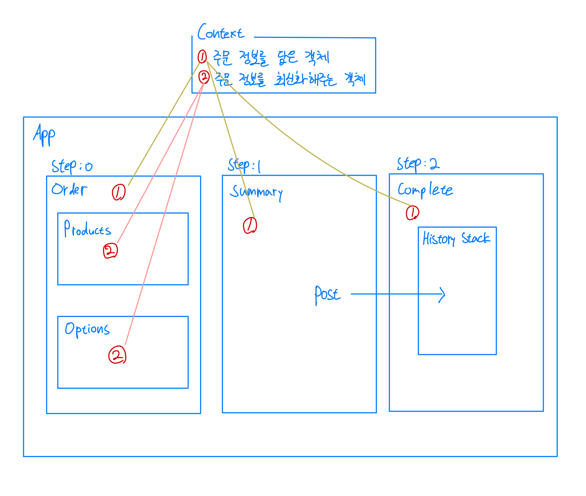
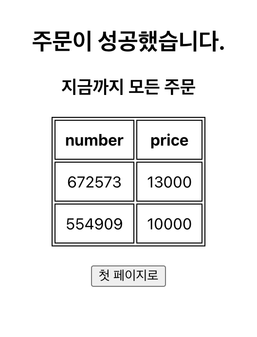

# Context API를 연습해보기 위한 프로젝트입니다.

React에 대한 지식이 얕은 상태에서 프로젝트를 진행할 때 전역 상태 관리에 대한 필요성을 느끼고 당시 제일 쉽게 활용할 수 있을 것 같아 보였던 recoil을 사용하며 전역 상태 관리에 대한 감을 익혔습니다. 추후 원활한 협업을 위해서는 다양한 기술을 활용해보는 것이 더욱 유리할 것이라고 생각되어 하나씩 접해보기 위해 시작하게 되었습니다.

개발 환경
Front : React, context API
Back-end : express.js(데이터베이스 없이 API가 호출되면 배열에 쌓이도록 구현)


step : 0


step : 1


step : 2


... 들어가기에 앞서

### 상태 관리란???

상태 관리라고 하려면 다음 3개의 조건을 만족해야 하는데

1. 초기 값 저장
2. 현재 값 읽기
3. 값 업데이트
   가 되어야 '상태 관리'라고 할 수 있음.

context API로 공유하는 값을 하위 컴포넌트에서 변경하고 공유하고 싶을 땐 setState 함수도 같이 전달해줘야 함.

따라서 context API는 다음의 이유로 전역 상태 관리 도구가 아님

1. 자체적으로 상태를 생성하거나 변경하는 기능이 내장되어 있지 않음, 그냥 이미 존재하는 상태를 하위에 전달하는 API일 뿐
2. context API에 상태 변화가 발생할 때 context를 구독하는 모든 컴포넌트가 리렌더링 됨(성능 이슈의 원인이 될 수 있음)
   => memo를 사용해 어느정도 극복이 가능하나 본질적인 문제 해결이 되지는 않음
   `context API는 상태를 컴포넌트 트리 내의 여러 계층에 걸쳐 쉽게 전달하기 위한 도구!!`

# 프로젝트를 하면서 새롭게 알게 된 점

### 컴포넌트의 본질

React 컴포넌트는 결국 자바스크립트 함수(또는 클래스)기 때문에 컴포넌트를 호출하는 것은 자바스크립트의 함수(또는 클래스)를 호출하는 것과 동일하다.
JSX에서 `<Producs/>`와 같은 표현은 정확히는 함수를 호출하는 것을 의미한다.(문법적으로 편리하게 만든 것일 뿐)
그렇기 때문에

```
const ItemComponent = orderType === 'products' ? Products : Options;
```

와 같은 문법으로 함수(컴포넌트)를 할당해줄 수 있게 되는 것

### Context API 사용 단계

1. context를 생성 => React에서 제공해주는 `createContext()`를 사용
2. context는 Provider 안에서 사용이 가능하기 때문에 Provider 생성

```
root.render(
    <OrderContext.Provider value = {value}>
        <App/>
    </OrderContext.Provider>
);
```

value에는 App 컴포넌트(자식 포함)에서 사용할 데이터 혹은 데이터를 업데이트하는 함수를 담음

3. 더 복잡한 로직을 구현하기 위해서 Provider를 위한 함수 생성

```
export function OrderContextProvider(props){
    return<OrderContext.Provider value = {vlaue}>{props.children}</OrderContext.Provider>;
}
```

OrderContextProvider함수 내부에서 로직을 구현하고 원하는 값들을 value를 통해 전달해주면 root에서

```
root.render(
    <OrderContextProvider>
        <App/>
    </OrderContextProvider>
);
```

`<OrderContextProvider>`로 감싼 컴포넌트에서 사용 가능

## value = {value}는 뭐고 {...props}는 또 뭐지?

`value`를 통해 전달해주는 것도 props라고 알고 있었는데 `{...props}`로는 무슨 내용을 전달해 주는 것인가?
=> Provider는 root 컴포넌트에서 전역 관리 대상인 컴포넌트를 감쌈,
감쌌던 컴포넌트를 렌더링하기 위해선 `{...props}`(여기에는 children 즉, 자식 컴포넌트가 포함됨)을 통해 렌더링해야함
🔴 but, 이제까지 자식 컴포넌트를 렌더링하기 위해서 `{...props}`를 사용했던 적은 없었는데 왜 여기서는 해줘야하나?
=> 일반적인 컴포넌트에서는 자동으로 렌더링해주는 기능을 제공해줘서 직접 렌더링 작업이 필요 없었지만, Provider에서는 해당 기능을 제공해주지 않음

### 단방향 바인딩

부모의 상태를 자식에게 전달할 수는 있지만 자식의 상태를 부모로 전달할 수는 없는 것을 의미함
부모의 상태를 바꾸는 setState 또한 여러 컴포넌트를 통해 전달해줘야 함.
(React는 단방향 바인딩,,, vue, angular 는 양방향 바인딩)
