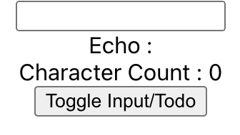

# recoil을 활용한 todoList 앱

연습용으로 구현한 글자수 세는 input과 분리하기 위해 라우터로 구분 -> Toggle Input/Todo 클릭하면 라우터 변경

## 구현한 기능

-   add Todo
-   
    
    
    input에 할 일 내용을 입력한 후 'Add todo' 버튼을 클릭하면 리스트에 추가
    
-   리스트 수정
-   
    
    
    input 박스에서 직접 수정할 수 있음
    
-   todo 항목 토글
-   
    
    
    체크박스 토글을 하면 Completed의 상태가 true로 바뀜
    
-   리스트 삭제
-   
    
    
    X 버튼을 누르면 배열에서 삭제
    
-   필터링 기능(전체, 끝낸 항목들만, 남은 항목들만)
-   
    
    
    필터의 상태가 All 일 땐 전체
    
    
    
    Completed일 땐 완료한 항목들
    
    
    
    Uncompleted일 땐 미완성 항목들만
    
-   통계
-   
    
    
    상태들을 통계로 보여줌

# 사용한 Recoil의 훅

-   useRecoilState : atom을 읽고 쓰게 하기 위한 도구, useState처럼 사용하면 되고 initialValue 자리에 atom 넣으면 됨
-   useRecoilValue : Recoil Selector(혹은 그 안에 있는 atom)의 값을 읽어오기 위해 사용
-   useSetRecoilState... 등등

# useRecoilState의 setter VS Selector의 set 순수함수 VS useSetRecoilState

-   useRecoilState의 setter : 현재 상태와 쓰기가 가능한 setter 함수 반환
-   selecor의 set 순수함수 : 복잡한 함수 로직을 캡슐화할 때 사용
-   useSetRecoilState : setter 함수만 반환

# Recoil의 비동기 요청 처리

selector의 순수함수로 처리, 한 번 호출한 내용은 자동으로 캐싱되어 요청이 바뀌지 않는 한 캐싱된 값을 반환해줌

# 새롭게 배운 기술

-   React의 Suspense : 컴포넌트의 렌더링을 일시 중지하고 데이터 로딩을 기다릴 수 있게 해줌 => 자연스러운 UX
-   lazy와 fallback
-   -   React.lazy() : dynamic import로 컴포넌트 렌더링 => 하는 이유? React는 기본적으로 SPA(Single Page Application)라 사용 안하는 컴포넌트까지 불러오는 단점이 있음.
-   -   React.Suspense : Router로 분기한 컴포넌트들을 lazy import하면 로딩시간 발생, 이 외에도 비동기 처리할 때도 사용함
