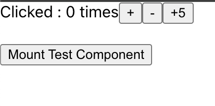
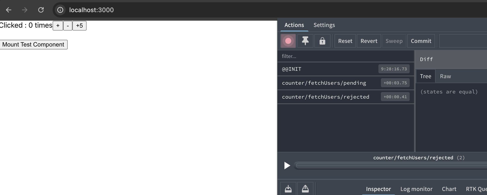

# action과 reducer는 모두 createSlice()를 통해 생성

1. action과 reducer를 동시에 설정할 수 있음
2. aciton과 reducer를 별도로 관리할 수 있음

두 가지의 장점을 가지고 있는 방식

# + 버튼

해당 버튼에 onClick 이벤트 발생 시 `counter/increment()`라는 이름의 액션이 dispatch 됨

# - 버튼

해당 버튼에 onClick 이벤트 발생 시 `counter/decrement()`라는 이름의 액션이 dispatch 됨

# +5 버튼

해당 버튼에 onClick 이벤트 발생 시 `counter/incrementAmount()`라는 이름의 액션이 dispatch 됨,
`dispatch(incrementAmount(5))`의 형식으로 호출하는데 인자로 들어가는 숫자는 `action.payload`에 들어가게 됨

내부적으로는

```{
    type : 'counter/increment',
    payload : 5
    }
```

액션을 생성할 때 들어가는 인자인 state에는 자동으로 현재의 상태가 들어가고 payload에는 `action.payload`가 들어감

# extraReducers

`createSlice()`는 외부의 action을 가져와서 사용할 수 있는 `extraReducers()`라는 메서드를 사용할 수 있음 => 어디서 사용되는 지는 뒤에서..

# createAction의 비동기 버전인 createAsyncThunk()

`createAsyncThunk()`는 action을 만들어주는 함수기 때문에 `createSlice()`를 사용한다면 `extraReducers()`와 함께 사용해야 함

# Mount Test Component 버튼

해당 버튼에 onClick 이벤트 발생 시 `createAsyncThunk()`로 만든 `fetchUsersAsync()`액션이 dispatch됨 해당 로직에서는 상태변화가 필요 없기 때문에 굳이 reducers는 구현하지 않았음

# fetchUsersAsync()

단순한 action객체가 아니라 비동기 작업을 시작하고 그 결과에 따라 적잘한 액션(pending, fulfilled, rejected)을 디스패치 하는 함수, 반환값으로는

1. Pending: 비동기 작업이 아직 완료되지 않았을 때
2. Fulfilled: 비동기 작업이 성공적으로 완료되었을 때
3. Rejected: 비동기 작업이 실패했을 때
   의 Promise를 가짐

# abort()

Redux Toolkit은 위의 Promise 객체에 abort 메서드를 추가함, 해당 메서드가 호출되면 진행 중인 비동기 작업을 취소할 수 있게 됨



비동기 작업(`setTimeout()`)이 끝나기 전에 버튼을 한번 더 누르면 `abort()`가 호출되도록 구현
